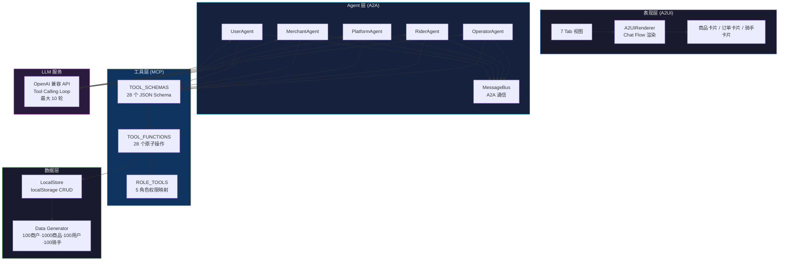
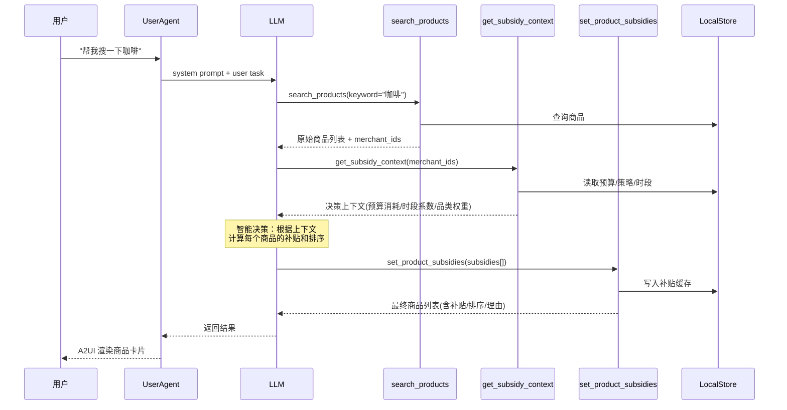
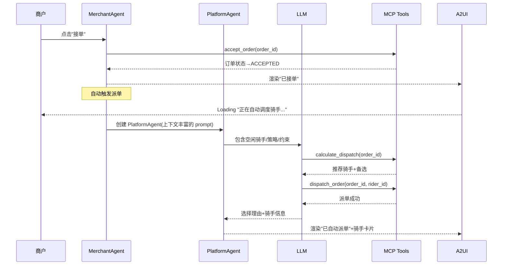
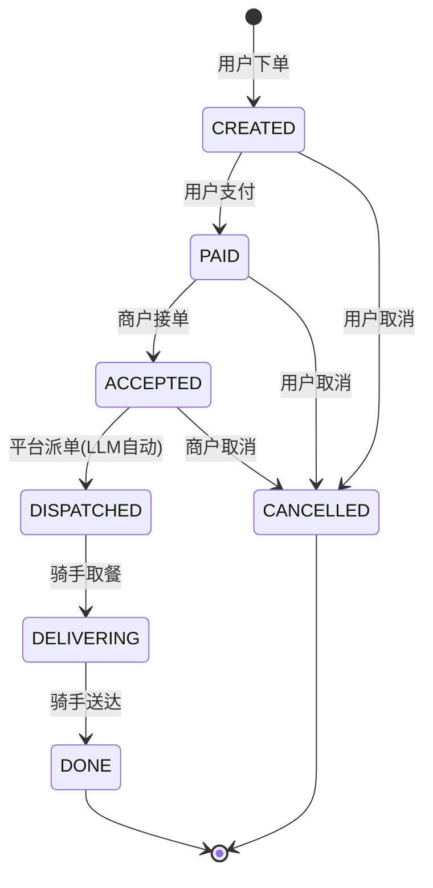

# AI-Native 外卖系统 (MCP + A2A + A2UI)

> 纯前端，纯本地，无任何服务端依赖，一个**单 HTML 文件**实现的 AI 原生外卖平台原型，集成 MCP 工具协议、多 Agent 协作（A2A）和 Agent-to-UI 渲染管线，展示 LLM 如何深度驱动业务全链路。

## 项目背景

传统外卖系统的核心逻辑（定价、补贴、派单、运营）由规则引擎或人工决策驱动。随着大模型能力的成熟，这些决策环节可以被 LLM 以 **工具调用（Tool Calling）** 的方式接管，实现真正的 **AI-Native** 架构。

本项目是对这一理念的完整技术验证：

- **不是** 在传统系统上"加一个聊天窗口"
- **而是** 让 LLM 作为每个角色的决策中枢，通过标准化工具协议操作业务数据

```
传统系统：用户操作 → 规则引擎 → 数据库
AI-Native：用户意图 → LLM Agent → MCP Tools → LocalStore
```

## 方案优势

### 1. 零部署 · 单文件架构
整个系统打包在 **一个 HTML 文件** 中（~3900 行），包含完整的 UI、样式、业务逻辑和 AI Agent 系统。打开浏览器即可运行，无需任何后端服务、数据库或 Node.js 环境。

### 2. 标准协议 · 三大规范落地
| 协议 | 说明 | 实现方式 |
|------|------|----------|
| **MCP** (Model Context Protocol) | LLM 操作外部系统的标准工具协议 | 28 个原子工具，JSON Schema 描述，按角色鉴权 |
| **A2A** (Agent-to-Agent) | 多 Agent 间的异步消息通信 | MessageBus 发布/订阅，支持意图路由 |
| **A2UI** (Agent-to-UI) | Agent 输出结构化 UI 组件 | JSON → HTML 渲染管线，Chat Flow 追加模式 |

### 3. LLM 深度决策 · 不只是对话
- **动态定价**：LLM 根据平台预算、时段系数、品类权重，实时计算每件商品的补贴和排序
- **智能派单**：LLM 综合距离、评分、成本、骑手负载，做出最优调度决策
- **活动设计**：LLM 根据平台统计数据，自主设计运营活动的规则和奖励

### 4. 五角色 · 全链路覆盖
系统模拟了外卖平台的 5 种核心角色，每个角色拥有独立的 Agent、工具权限和 UI 视角：

| 角色 | Agent | 工具数 | 职责 |
|------|-------|--------|------|
| 用户 | UserAgent | 12 | 搜索商品、下单支付、参与活动、触发 LLM 定价管线 |
| 商户 | MerchantAgent | 5 | 接单/拒单、设置补贴策略 |
| 平台 | PlatformAgent | 8 | 智能调度派单、查看统计 |
| 骑手 | RiderAgent | 3 | 开始配送、完成配送 |
| 运营 | OperatorAgent | 6 | 配置策略、设置补贴、创建活动 |

### 5. 内置测试 · 可验证
- 7 个自动化测试场景覆盖正常流程、拒单、补贴、派单、活动推广、LLM 动态定价、接单自动派单
- 28 个工具一键测试面板，智能 Demo 数据，实时展示调用结果
- A2UI 可视化验证面板，所有 Agent 输出可视化呈现

## 技术架构

### 整体分层



### LLM 动态定价管线



### 接单自动派单链路



### 订单状态机



## MCP 工具清单

系统实现了 **28 个原子工具**，按角色分为 5 组：

### 用户工具 (12)
| 工具 | 说明 |
|------|------|
| `list_merchants` | 列出所有商家，支持品类筛选 |
| `get_merchant_menu` | 获取商家完整菜单 |
| `search_products` | 搜索商品，含补贴信息 |
| `create_order` | 创建订单 |
| `pay_order` | 支付订单 |
| `cancel_order` | 取消订单 |
| `get_order` | 查询订单详情 |
| `list_orders` | 列出订单列表 |
| `get_subsidy_context` | 获取补贴决策上下文 |
| `set_product_subsidies` | LLM 设置商品补贴和排序 |
| `list_promotions` | 查看平台活动 |
| `apply_promotion` | 参与活动领取奖励 |

### 商户工具 (5)
| 工具 | 说明 |
|------|------|
| `accept_order` | 接受订单 |
| `reject_order` | 拒绝订单 |
| `get_order` | 查询订单 |
| `list_orders` | 查看订单列表 |
| `set_merchant_subsidy` | 设置商家补贴策略 |

### 平台工具 (8)
| 工具 | 说明 |
|------|------|
| `list_available_riders` | 列出空闲骑手 |
| `calculate_dispatch` | 计算最优派单方案 |
| `dispatch_order` | 分配骑手 |
| `batch_dispatch` | 批量派单 |
| `get_order` | 查询订单 |
| `list_orders` | 查看订单列表 |
| `get_platform_stats` | 获取平台统计数据 |
| `get_config` | 获取平台配置 |

### 骑手工具 (3)
| 工具 | 说明 |
|------|------|
| `start_delivery` | 开始配送 |
| `complete_delivery` | 完成配送 |
| `get_order` | 查看订单详情 |

### 运营工具 (6)
| 工具 | 说明 |
|------|------|
| `get_config` | 获取策略配置 |
| `update_config` | 修改策略配置 |
| `set_platform_subsidy` | 设置平台补贴 |
| `get_platform_stats` | 查看平台统计 |
| `create_promotion` | 创建运营活动 |
| `list_promotions` | 查看活动列表 |

## 快速开始

### 直接打开

下载 `index.html`，用浏览器打开即可。

### 配置 LLM

系统需要 OpenAI 兼容的 API 服务。有两种配置方式：

**方式一：页面内配置**

点击页面顶部「展开配置」，填写：
- API URL（默认：`https://dashscope.aliyuncs.com/compatible-mode/v1`）
- Model（默认：`qwen3-max`）
- API Key（必填）

**方式二：URL 参数传入**

```
index.html?url=https://your-api.com/v1&model=your-model&key=sk-your-key
```

> 三个参数（URL、Model、Key）均为必填项。任一为空时，调用 LLM 会提示配置不完整。

### GitHub Pages 在线访问

本项目已配置 GitHub Actions 自动部署，每次 push 到 main 分支会自动发布到 GitHub Pages。<https://100apps.github.io/llm_takeout_qoder/>

## 数据规模

系统启动时自动生成模拟数据：

| 数据类型 | 数量 | 说明 |
|----------|------|------|
| 商户 | 100 | 12 个品类（咖啡、奶茶、中餐、西餐、火锅等） |
| 商品 | 1000 | 每商户 10 个菜品，含分类和补贴配置 |
| 用户 | 100 | 含余额、会员等级、地址 |
| 骑手 | 100 | 含评分、最大并发单量、配送统计 |
| 订单 | 100 | 覆盖全部 7 种状态 |

## 测试场景

| 场景 | 说明 | 验证点 |
|------|------|--------|
| 场景 1 | 正常流程 | 下单→支付→接单→派单→配送→完成 |
| 场景 2 | 商户拒单 | 下单→支付→商户拒绝→订单取消 |
| 场景 3 | 补贴流程 | 设置补贴→创建订单→验证补贴价格 |
| 场景 4 | 智能派单 | 创建订单→LLM 计算最优骑手→派单 |
| 场景 5 | 活动推广 | 运营创建活动→用户查看→用户参与→余额增加 |
| 场景 6 | LLM 动态定价 | 3 步管线：搜索→上下文→LLM 定价排序 |
| 场景 7 | 接单自动派单 | 商户接单→自动触发 PlatformAgent 派单 |

## 技术栈

- **前端**：原生 HTML/CSS/JavaScript（零依赖）
- **存储**：localStorage（浏览器本地）
- **LLM**：OpenAI 兼容 API（Tool Calling）
- **部署**：GitHub Pages（静态托管）

## License

MIT
